``` 
 █▀ █▀▀ █▄░█ ▀█▀ █░█
 ▄█ ██▄ █░▀█ ░█░ █▄█
```
---

# Snake AI Rust (`snake-ai`)

Plataforma experimental en Rust que compara y enfrenta dos paradigmas de Inteligencia Artificial en el clásico juego de **Snake**:
- **Algoritmo Genético Neuroevolutivo (GA)**: Redes neuronales evolucionadas mediante algoritmo genético con modelo de islas (*Streams*), elitismo garantizado (*Hall of Fame*), mutaciones guiadas y visión sensorial por raycast.
- **Deep Q-Network (DQN)**: Aprendizaje por refuerzo profundo implementado en Rust puro (sin dependencias de PyTorch ni Python), con *Experience Replay Buffer*, *Target Network*, exploración *Epsilon-Greedy* y representación sensorial relativa a la cabeza.

La aplicación compila en un **único binario unificado** de alto rendimiento con interfaz gráfica fluida en **Macroquad**, soporte para pantalla completa, sistema de temas visuales, dashboards analíticos en tiempo real y arenas de combate cara a cara.

---

## 🏗️ Arquitectura Limpia (*Clean Architecture*)

El proyecto está diseñado bajo principios de arquitectura limpia y separación estricta de responsabilidades:

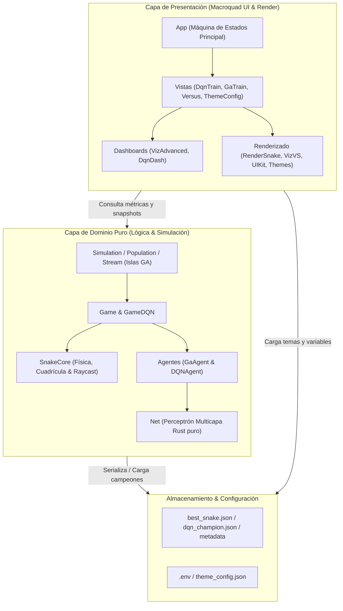

- **Capa de Dominio puro (`src/domain/`)**: Lógica de simulación, física de la cuadrícula, mecánicas de serpiente y alimento perecedero, redes neuronales (`Net`), agentes (`GaAgent`, `DQNAgent`), gestión de poblaciones (`Stream`, `Population`, `Simulation`) y juego DQN (`GameDQN`). **100% independiente de Macroquad y píxeles**, lo que permite pruebas unitarias ultrarrápidas y sin dependencias gráficas.
- **Capa de Presentación (`src/presentation/`)**: Máquina de estados de la aplicación (`App`), vistas individuales (`src/presentation/views/`), kit de UI y tipografías embebidas (`ui_kit`), renderizado vectorial de serpientes (`render_snake`), dashboards avanzados (`viz_advanced`, `dqn_dash`), arenas de versus (`viz_vs`) y temas visuales (`theme`).
- **Capa de Infraestructura / Configuración (`src/domain/env_config.rs`, `src/domain/configs.rs`)**: Carga dinámica de variables de entorno mediante `.env` con valores por defecto seguros.

---

## 🎮 Modos de la Aplicación y Galería Visual

El menú principal permite acceder a **6 vistas interactivas**. Las sesiones de entrenamiento se pueden pausar en cualquier momento con `Esc` para regresar al menú y reanudarse posteriormente sin perder el progreso ni la memoria acumulada.

<div align="center">
  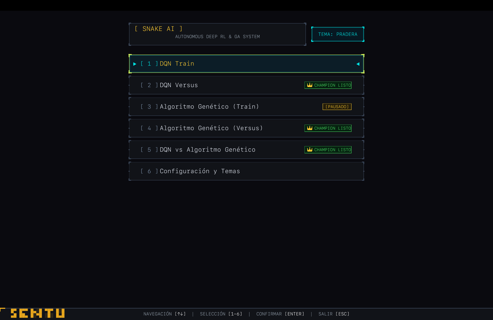
  <p><em>Menú Principal unificado con branding retro, indicador de sesiones pausadas y acceso directo a los 6 modos.</em></p>
</div>

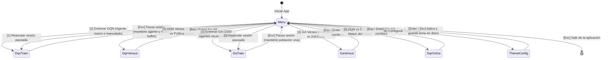

| Opción | Modo | Descripción |
| :---: | :--- | :--- |
| `1` | **DQN Train** | Entrenamiento continuo por refuerzo profundo. Pausable y reanudable en memoria. |
| `2` | **DQN Versus** | Combate en arena entre el Campeón DQN guardado y la política activa en entrenamiento (o subcampeón). |
| `3` | **GA Train** | Neuroevolución con 1000 serpientes simultáneas por isla, elitismo *Hall of Fame* y dashboards en vivo. |
| `4` | **GA Versus** | Combate en arena entre el Campeón histórico de GA y el Segundo Mejor. |
| `5` | **DQN vs GA (Cross-Match)** | Duelo definitivo entre el Campeón de Aprendizaje por Refuerzo y el Campeón Genético. |
| `6` | **Theme Config** | Selector interactivo de temas visuales para la interfaz y el juego. |

---

### Detalle de Modos y Vistas

#### 1. DQN Train — Aprendizaje por Refuerzo Profundo
Entrenamiento en vivo con visualización del tablero y panel analítico completo: historial de recompensas, estimación de valores Q, decaimiento de exploración $\epsilon$ y pérdida del gradiente.

<div align="center">
  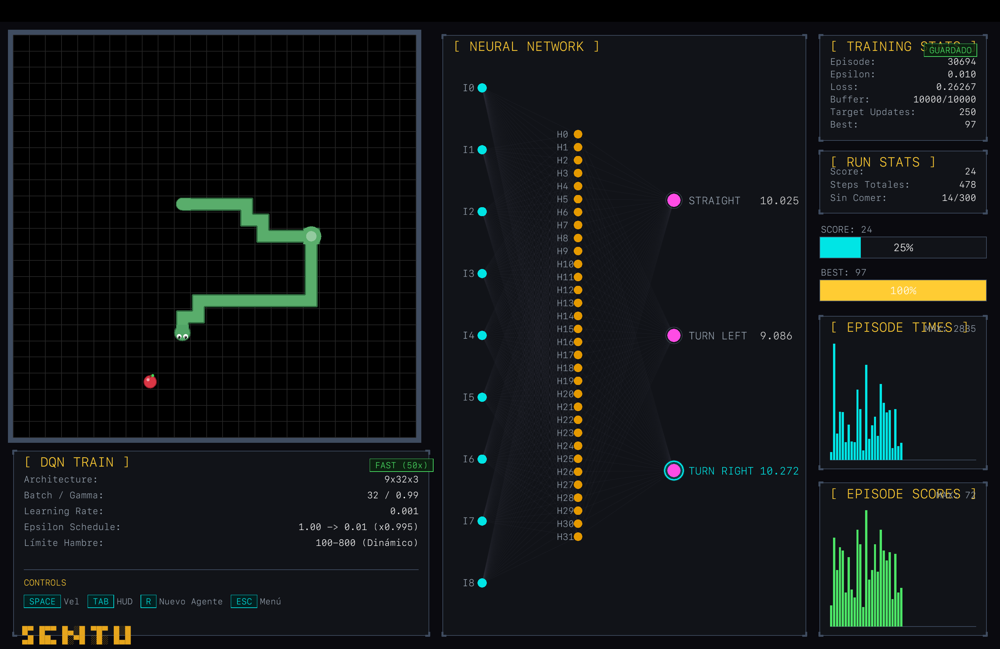
</div>

- **Controles**:
  - `Espacio`: Alterna entre velocidad rápida (hasta 50 pasos/frame) y normal (1 paso/frame con retardo).
  - `Tab`: Alterna entre el **Dashboard analítico avanzado** y el **HUD compacto**.
  - `R`: Reinicia a un agente limpio ($\epsilon = 1.0$) conservando a salvo el récord y el archivo del campeón.
  - `Esc`: Pausa el entrenamiento y regresa al menú principal (sesión preservada en memoria).

#### 2. DQN Versus — Arena DQN (Champion vs Política Activa)
Enfrentamiento simultáneo en pantalla dividida entre la red neuronal del campeón consolidado (`dqn_champion.json`) y la política que se encuentra actualmente en entrenamiento o subcampeón.

<div align="center">
  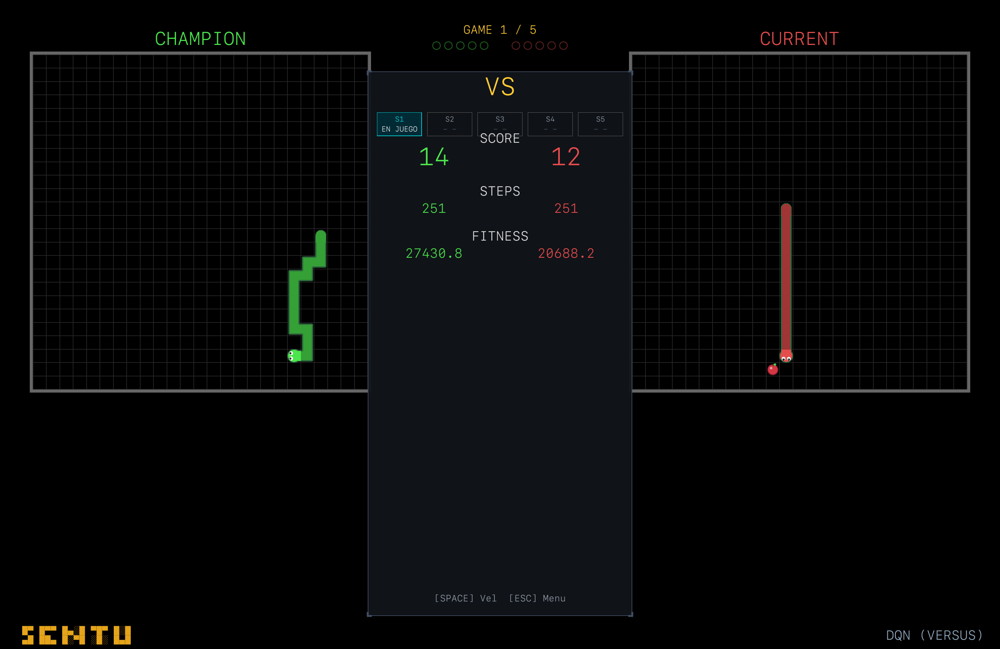
</div>

- **Controles**:
  - `R`: Reinicia la serie o solicita revancha una vez concluida la partida.
  - `Enter`: Confirma el resultado final y regresa al menú.
  - `Esc`: Aborta el enfrentamiento y regresa al menú.

#### 3. GA Train — Neuroevolución con Modelo de Islas
Simulación paralela de 1000 serpientes por isla con panel generacional avanzado: curvas históricas de duración y longitud máxima alcanzada, tabla de clasificación de mejores individuos vivos y seguimiento del campeón.

<div align="center">
  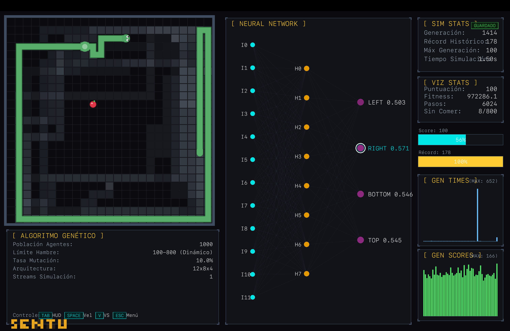
</div>

- **Controles**:
  - `Espacio`: Alterna entre simulación ultrarrápida por lotes y visualización paso a paso.
  - `Tab`: Alterna entre el **Dashboard generacional** (`VizAdvanced`) y el **HUD compacto**.
  - `V`: Activa el modo Versus interno (enfrentamiento directo entre el mejor y el segundo mejor de la simulación).
  - `Esc`: Pausa el entrenamiento y regresa al menú (población viva conservada en memoria).

#### 4. GA Versus — Arena de Campeones Genéticos
Duelo en arena cara a cara entre el Campeón Histórico Absoluto (`best_snake.json`) y el Segundo Mejor espécimen registrado en la historia evolutiva (`sim_metadata.json`).

<div align="center">
  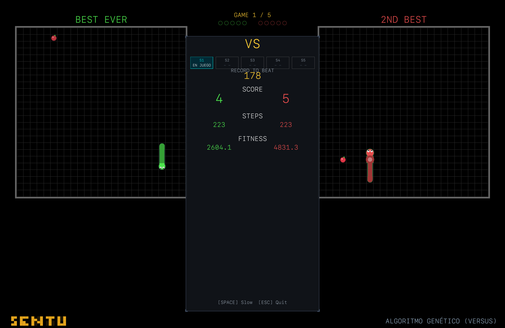
</div>

- **Controles**:
  - `R`: Reinicia la serie / revancha.
  - `Enter`: Confirma el ganador y regresa al menú.
  - `Esc`: Sale al menú principal.

#### 5. DQN vs GA — Duelo de Paradigmas (Cross-Match)
Combate definitivo entre los dos enfoques de Inteligencia Artificial: la red del Campeón entrenada mediante gradiente y refuerzo profundo (DQN) contra la red del Campeón evolucionada mediante selección natural y mutación (GA).

<div align="center">
  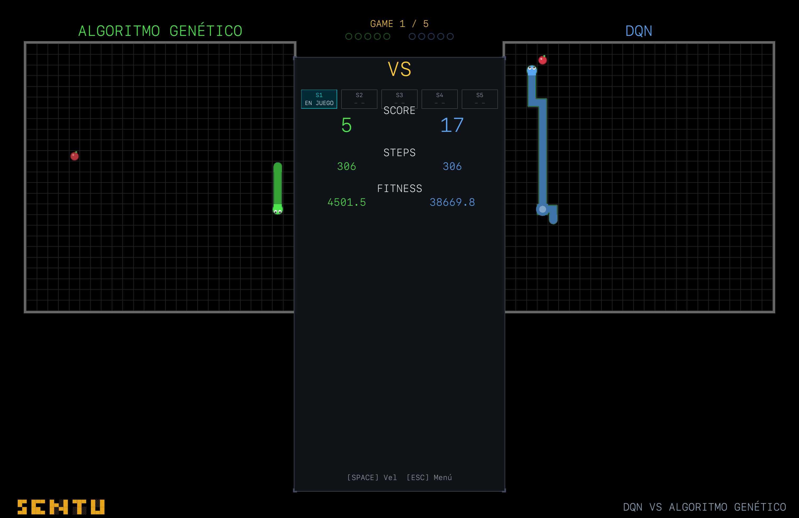
</div>

- **Controles**:
  - `R`: Reinicia la serie / revancha al finalizar.
  - `Enter`: Confirma el resultado al finalizar y vuelve al menú.
  - `Esc`: Aborta la partida o regresa al menú.

#### 6. Theme Config — Selector de Temas Visuales
Permite personalizar la apariencia estética del juego y la interfaz en tiempo real, con 4 temas diseñados a medida: **Retro**, **Arcade**, **Pleasant** y **Meadow**.

<div align="center">
  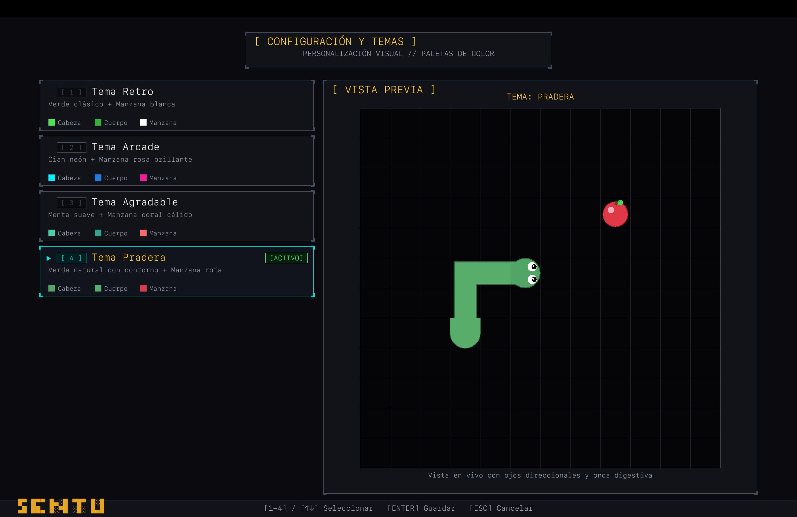
</div>

- **Controles**:
  - `1` al `4` o `Up` / `Down` / `W` / `S`: Selecciona tema.
  - `Enter` o `Esc`: Aplica el tema seleccionado, lo guarda en `theme_config.json` y regresa al menú.

---

## 🧠 Algoritmos e Implementación

### Algoritmo Genético Neuroevolutivo (GA)

El algoritmo genético opera bajo un modelo de islas (*Streams*) donde poblaciones de 1000 serpientes evolucionan en paralelo:

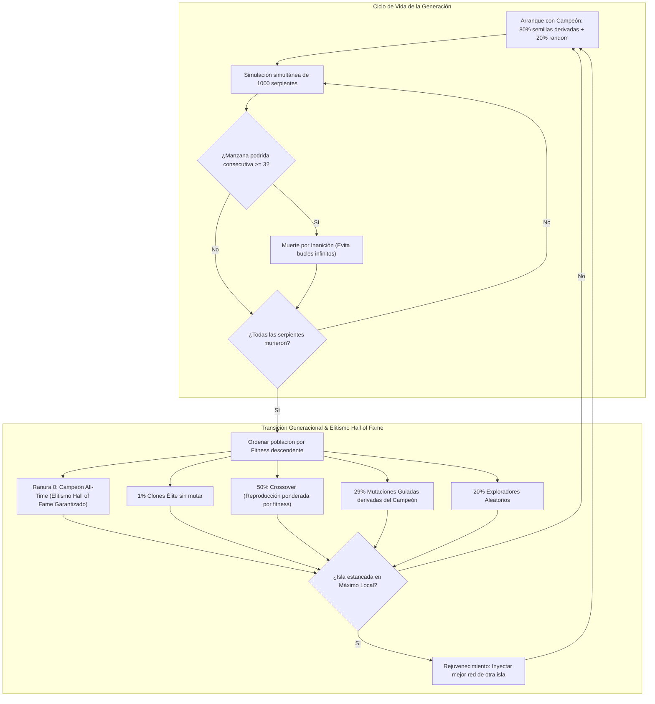

- **Población e Islas**: 1000 serpientes por *Stream* compitiendo en paralelo. Se aplica rejuvenecimiento migratorio si una isla cae en máximos locales estancados.
- **Arranque en Caliente (*Warm-Start*)**: Si existe un campeón previo (`sim_metadata.json` o `best_snake.json`), la población inicial se siembra con clones exactos y mutaciones guiadas alrededor del campeón (80%), junto con exploradores aleatorios (20%).
- **Elitismo Permanente (*Hall of Fame*)**: La ranura 0 de cada generación está reservada estrictamente para el mejor genoma de todos los tiempos, garantizando que el campeón nunca se extinga por una mala generación.
- **Prevención de Bucles Infinitos**: Si una serpiente deja pudrir 3 manzanas consecutivas sin alimentarse, es eliminada por inanición para garantizar el avance generacional.

---

### Percepción Sensorial por Raycast (GA y DQN)

Ambos paradigmas perciben el entorno a través de un sistema de coordenadas relativo a la orientación actual de la cabeza de la serpiente:

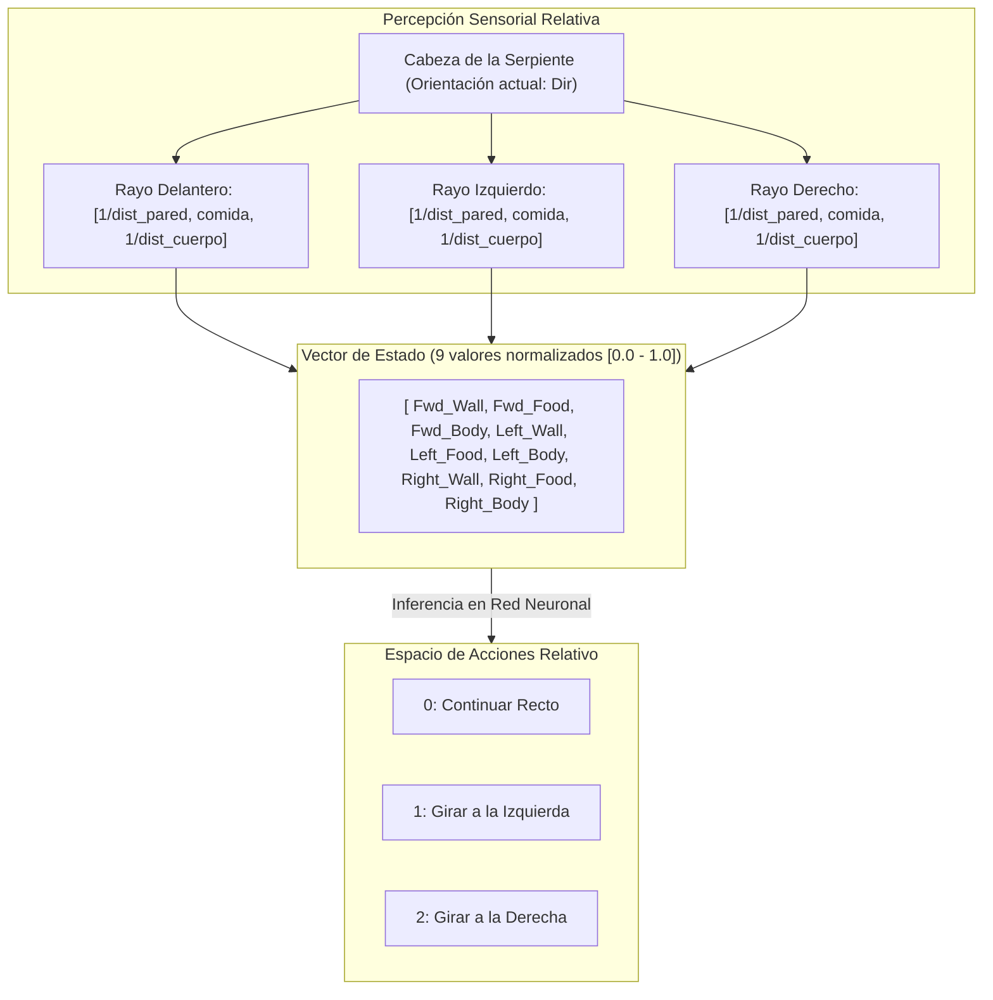

- **Diferenciación de Obstáculos**: El raycast calcula con precisión matemática la distancia física hasta el muro exterior (`wall_dist = 1.0 / dist`) separándola de la distancia al propio cuerpo (`body_dist = 1.0 / body_step` o `0.0` si la trayectoria está libre).

---

### Deep Q-Network (DQN)

El agente DQN aprende de forma individual y continua a través de aprendizaje por refuerzo con memoria de experiencia y redes duales:

```mermaid
flowchart LR
    subgraph ExperienceLoop["Bucle de Experiencia (GameDQN)"]
        direction TB
        State["Estado s (9 entradas relativas)"]
        EpsGreedy{"Epsilon-Greedy"}
        ActRand["Exploración (Probabilidad ε)"]
        ActMax["Explotación (argmax Q(s, a))"]
        EnvStep["Paso en el entorno: Nueva distancia, comer, choque"]
        Reward["Recompensa r (+1.0 comer, +0.1 acerca, -0.01 paso, -1.0 muerte)"]
        
        State --> EpsGreedy
        EpsGreedy -- Random --> ActRand
        EpsGreedy -- Argmax --> ActMax
        ActRand & ActMax --> EnvStep
        EnvStep --> Reward
    end

    subgraph MemoryBuffer["Memoria de Experiencias"]
        direction TB
        Replay[("Replay Buffer (10,000 transiciones)")]
        Batch["Muestreo Minibatch aleatorio (32 experiencias)"]
        
        Reward -->|"Guardar (s, a, r, s', done)"| Replay
        Replay --> Batch
    end

    subgraph NetworkTraining["Optimización de Redes"]
        direction TB
        QNet["Q-Network (Estima Q(s, a))"]
        TargetNet["Target Network (Copia fija temporal)"]
        Bellman["Objetivo Bellman: r + γ * max Q_target(s', a')"]
        Loss["Error Cuadrático Medio (MSE)"]
        Backprop["Backpropagation & Descenso de Gradiente"]

        Batch --> Bellman
        TargetNet --> Bellman
        Batch --> QNet
        QNet & Bellman --> Loss
        Loss --> Backprop
        Backprop -->|"Actualizar pesos"| QNet
        QNet -.->|"Sincronización cada 100 pasos"| TargetNet
    end
```

- **Red Neuronal y Acciones**: Arquitectura $9 \to 32 \to 3$ con acciones relativas a la dirección de avance (recto, izquierda, derecha).
- **Entrenamiento Estable**:
  - *Experience Replay Buffer* de 10,000 transiciones para romper la correlación temporal.
  - Minibatches aleatorios de 32 experiencias para actualización por gradiente.
  - *Target Network* sincronizada periódicamente para evitar divergencias en los valores Q.
  - Decaimiento de $\epsilon$ desde 1.0 hasta 0.01.
- **Persistencia**: Snapshot automático de pesos en cada nuevo récord a `dqn_champion.json` y metadatos de sesión en `dqn_metadata.json`.

---

## 📁 Archivos y Persistencia

| Archivo | Propósito |
| :--- | :--- |
| `best_snake.json` | Pesos de la red neuronal del campeón histórico GA (JSON con arquitectura serde). |
| `sim_metadata.json` | Metadatos de GA: número de generaciones, récord máximo histórico, segundo récord y series de tiempo/score para gráficos. |
| `dqn_champion.json` | Pesos de la red neuronal del mejor agente DQN obtenido. |
| `dqn_metadata.json` | Metadatos de DQN: récord de puntuación, episodio alcanzado y valor de epsilon. |
| `theme_config.json` | Configuración guardada del tema visual activo. |
| `.env` / `.env.example` | Variables de entorno configurables en tiempo de ejecución (tasas de mutación, tamaños de lote, etc.). |

---

## 🚀 Compilación y Ejecución

### Requisitos
- Rust 1.75+ con Cargo (edición 2021).

### Ejecutar la Aplicación
```bash
# Compilar y ejecutar en modo optimizado (pantalla completa)
cargo run --release
```

### Ejecutar la Suite de Pruebas
El proyecto cuenta con una amplia batería de pruebas unitarias que validan la física, la visión sensorial, los agentes, la robustez numérica y las transiciones del menú:
```bash
cargo test
```
*(179 tests unitarios pasando, 0 fallos)*.

